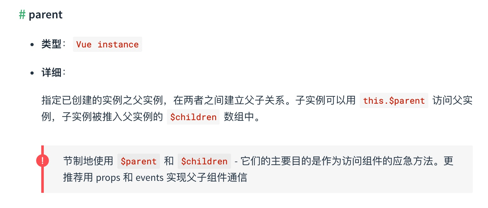

# vue实战get

## 组件之间通信
- 父子组件之间通信
- 非父子组件之间通信(兄弟组件、隔代关系组件等)


### 一、props / $emit

#### 1. 父组件向子组件传值
父组件通过`props`的方式向子组件传递数据，而通过`$emit` 子组件可以向父组件通信。

> Tip: prop 只可以从上一级组件传递到下一级组件（父子组件），即所谓的单向数据流。而且 prop 只读，不可被修改，所有修改都会失效并警告。

### 二、 $children / $parent



> 要注意边界情况，如在#app上拿$parent得到的是new Vue()的实例，在这实例上再拿$parent得到的是undefined，而在最底层的子组件拿$children是个空数组。也要注意得到$parent和$children的值不一样，$children 的值是数组，而$parent是个对象

```
// 父组件中
<template>
  <div class="hello_world">
    <div>{{msg}}</div>
    <com-a></com-a>
    <button @click="changeA">点击改变子组件值</button>
  </div>
</template>

<script>
import ComA from './test/comA.vue'
export default {
  name: 'HelloWorld',
  components: { ComA },
  data() {
    return {
      msg: 'Welcome'
    }
  },

  methods: {
    changeA() {
      // 获取到子组件A
      this.$children[0].messageA = 'this is new value'
    }
  }
}
</script>

```

```
// 子组件中
<template>
  <div class="com_a">
    <span>{{messageA}}</span>
    <p>获取父组件的值为:  {{parentVal}}</p>
  </div>
</template>

<script>
export default {
  data() {
    return {
      messageA: 'this is old'
    }
  },
  computed:{
    parentVal(){
      return this.$parent.msg;
    }
  }
}
</script>

```
 

### 三、provide/ inject

provide/ inject 是vue2.2.0新增的api, 简单来说就是父组件中通过provide来提供变量, 然后再子组件中通过inject来注入变量。

> 注意: 这里不论子组件嵌套有多深, 只要调用了inject 那么就可以注入provide中的数据，而不局限于只能从当前父组件的props属性中回去数据

接下来就用一个例子来验证上面的描述: 假设有三个组件: A.vue、B.vue、C.vue 其中 C是B的子组件，B是A的子组件

```
// A.vue

<template>
  <div>
	<comB></comB>
  </div>
</template>

<script>
  import comB from '../components/test/comB.vue'
  export default {
    name: "A",
    provide: {
      for: "demo"
    },
    components:{
      comB
    }
  }
</script>

```

```
// B.vue

<template>
  <div>
    {{demo}}
    <comC></comC>
  </div>
</template>

<script>
  import comC from '../components/test/comC.vue'
  export default {
    name: "B",
    inject: ['for'],
    data() {
      return {
        demo: this.for
      }
    },
    components: {
      comC
    }
  }
</script>

```

```
// C.vue
<template>
  <div>
    {{demo}}
  </div>
</template>

<script>
  export default {
    name: "C",
    inject: ['for'],
    data() {
      return {
        demo: this.for
      }
    }
  }
</script>

```

### 四、ref / refs

ref：如果在普通的 DOM 元素上使用，引用指向的就是 DOM 元素；如果用在子组件上，引用就指向组件实例，可以通过实例直接调用组件的方法或访问数据.

```
// 子组件 A.vue

export default {
  data () {
    return {
      name: 'Vue.js'
    }
  },
  methods: {
    sayHello () {
      console.log('hello')
    }
  }
}


```

```
// 父组件 app.vue

<template>
  <component-a ref="comA"></component-a>
</template>
<script>
  export default {
    mounted () {
      const comA = this.$refs.comA;
      console.log(comA.name);  // Vue.js
      comA.sayHello();  // hello
    }
  }
</script>

```

### 五、eventBus

eventBus 又称为事件总线，在vue中可以使用它来作为沟通桥梁的概念, 就像是所有组件共用相同的事件中心，可以向该中心注册发送事件或接收事件， 所以组件都可以通知其他组件。

> Tip: eventBus也有不方便之处, 当项目较大,就容易造成难以维护的灾难.


### 六、Vuex 

